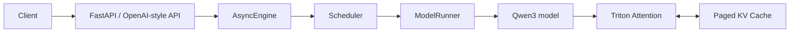

# Nano-vLLM

Nano-vLLM is an educational, lightweight LLM inference engine implemented from scratch. It is intended to make modern serving-system ideas easy to inspect and discuss: paged KV cache, prefix caching, chunked prefill, preemption, Triton attention kernels, CUDA Graph replay, tensor parallel execution, and an OpenAI-style streaming API.

It is not presented as a production-grade vLLM replacement. The codebase is deliberately small and currently optimized around the implemented Qwen3 path rather than broad model compatibility or full OpenAI API coverage.

## Features

### Core engine

- Continuous batching with separate waiting and running queues.
- Paged KV cache with physical blocks, per-sequence block tables, reference counts, and block reuse.
- Prefix caching based on chained hashes of complete token blocks.
- Chunked prefill so long prompts can progress without monopolizing the whole token budget.
- Decode-time preemption: when KV blocks are unavailable, running sequences can be returned to the waiting queue and recomputed later.

### Execution optimizations

- Triton KV-cache store kernel.
- Triton varlen prefill attention for dense prefill.
- Triton paged prefill attention for cached-prefix prefill.
- Triton paged decode attention that reads directly from page tables and valid context lengths.
- GQA-aware attention head mapping and online safe softmax in custom kernels.
- CUDA Graph replay for decode batches when eager mode is disabled.
- Tensor parallel execution with NCCL-backed worker processes.

### Serving

- `LLM.generate()` offline API.
- `AsyncEngine` for async request intake and per-token output events.
- FastAPI server with OpenAI-style `/v1/completions`, `/v1/chat/completions`, `/v1/models`, and `/health` endpoints.
- SSE streaming for single-prompt completions and chat completions.

## Architecture



## Architecture at a glance

- **Paged KV cache**: K/V tensors are stored in fixed-size physical blocks. Each sequence owns a logical block table that maps token positions to physical cache blocks.
- **Prefix cache**: complete blocks are hashed with the previous block hash, allowing later requests with the same full-block prefix to reuse cached K/V blocks via reference counts.
- **Chunked prefill and preemption**: the scheduler scans waiting requests under a token budget, chunks long prefills, decodes running requests, and preempts requests when new KV blocks cannot be appended.
- **Triton attention**: prefill uses either dense varlen attention or paged prefill when cached prefix blocks exist. Decode uses a paged kernel that walks block tables directly and performs online softmax.
- **CUDA Graph and tensor parallelism**: decode batches can replay captured CUDA Graphs up to the configured graph batch sizes. Tensor parallel ranks run as worker processes coordinated through NCCL and shared-memory commands.

For the full design, see [docs/architecture.md](docs/architecture.md).

## Support scope and limitations

- Current model implementation: `nanovllm/models/qwen3.py` (`Qwen3ForCausalLM`). The project currently does not expose a general model registry for arbitrary Hugging Face CausalLM architectures.
- Sampling parameters currently include `temperature`, `max_tokens`, and `ignore_eos`. Greedy sampling, top-k, top-p, repetition penalty, stop strings, seed control, and logprobs are not implemented.
- Serving supports the main completions and chat-completions request/streaming shapes, but it is not a complete OpenAI API implementation. Cancellation, timeouts, backpressure, readiness probes, structured error semantics, and protocol compatibility tests remain roadmap work.
- Quantization, LoRA, multi-model routing, and production observability are not implemented.
- Existing performance numbers are specific to the recorded environment and workload. They are not a same-condition comparison against vLLM, Hugging Face generate, or another serving engine.

## Model download

Example model used by the current baseline:

```bash
hf download Qwen/Qwen3-0.6B \
  --local-dir ~/huggingface/Qwen3-0.6B/ \
  --no-local-dir-use-symlinks \
  --max-workers 8
```

## Quick start

### Offline generation

```python
from nanovllm import LLM, SamplingParams

llm = LLM(
    "/root/huggingface/Qwen3-0.6B",
    enforce_eager=True,
    tensor_parallel_size=1,
    dtype="float16",
)
sampling_params = SamplingParams(temperature=0.6, max_tokens=128)
outputs = llm.generate(["Hello, Nano-vLLM."], sampling_params)
print(outputs[0]["text"])
```

### OpenAI-style API server

Install serving extras if needed:

```bash
pip install -e .[serve]
```

Start the server:

```bash
python -m nanovllm.entrypoints.openai.api_server \
  --model /root/huggingface/Qwen3-0.6B \
  --served-model-name qwen3-0.6b \
  --host 0.0.0.0 \
  --port 8000 \
  --tensor-parallel-size 1 \
  --max-model-len 512 \
  --max-num-seqs 8 \
  --gpu-memory-utilization 0.5
```

Streaming completions request:

```bash
curl -N http://localhost:8000/v1/completions \
  -H "Content-Type: application/json" \
  -d '{
    "model": "qwen3-0.6b",
    "prompt": "Explain paged KV cache in one paragraph.",
    "max_tokens": 64,
    "temperature": 0.6,
    "stream": true
  }'
```

Streaming chat request:

```bash
curl -N http://localhost:8000/v1/chat/completions \
  -H "Content-Type: application/json" \
  -d '{
    "model": "qwen3-0.6b",
    "messages": [{"role": "user", "content": "What does Nano-vLLM implement?"}],
    "max_tokens": 64,
    "temperature": 0.6,
    "stream": true
  }'
```

## Validation and performance

Correctness baseline:

```bash
/opt/anaconda3/bin/python -m pytest -q
```

Recent project baseline: `7 passed`.

Historical performance record for Qwen3-0.6B on 2 x RTX 2080 Ti, 8 concurrent requests, 128 input tokens, and 64 output tokens:

| Mode | End-to-end output throughput |
| --- | ---: |
| Nano-vLLM eager | ~306 tok/s |
| Nano-vLLM CUDA Graph | ~1410 tok/s |

A strict controlled offline benchmark, using identical deterministic prompt token IDs, fixed output length, aligned batch constraints, and 10 measured runs, is available in [docs/benchmarks/offline_comparison_strict_2026-07-12.md](docs/benchmarks/offline_comparison_strict_2026-07-12.md):

| Engine | Mode | Mean output tok/s | Stddev | Min | Max |
| --- | --- | ---: | ---: | ---: | ---: |
| Nano-vLLM | eager | 311.09 | 1.66 | 308.17 | 312.97 |
| Nano-vLLM | CUDA Graph | 1412.67 | 2.27 | 1409.66 | 1417.26 |
| Hugging Face | generate | 302.23 | 0.25 | 301.92 | 302.55 |
| vLLM | offline generate | 1394.37 | 15.62 | 1376.34 | 1413.27 |

This is an offline generation benchmark, not an online serving latency benchmark. vLLM was run through a project-local venv runner created with `--system-site-packages`, reusing the preinstalled `vllm==0.24.0` package from the Conda environment; it is not a fully independent dependency environment.

A follow-up 3x3 offline workload matrix is available in [docs/benchmarks/offline_matrix_2026-07-12.md](docs/benchmarks/offline_matrix_2026-07-12.md). In that run, Nano-vLLM CUDA Graph is roughly tied with or slightly faster than vLLM only at the short-context batch-8 and batch-16 workloads (`input_len=128`), while vLLM is faster on the measured longer-context workloads. The heaviest workload (`input_len=2048`, `num_seqs=16`) is incomplete because Hugging Face preflight OOMed on this host.

See [docs/benchmark.md](docs/benchmark.md) for the full evidence split and caveats.

## Documentation

- [Architecture](docs/architecture.md)
- [Correctness and performance baseline](docs/baseline.md)
- [Benchmark evidence and protocol](docs/benchmark.md)
- [Strict offline benchmark report](docs/benchmarks/offline_comparison_strict_2026-07-12.md)
- [3x3 offline matrix report](docs/benchmarks/offline_matrix_2026-07-12.md)
- [Long-context profiling report](docs/profiling_long_context.md)
- [AI Infra optimization plan](docs/AI_INFRA_OPTIMIZATION_PLAN.md)
- [Completed AI Infra work](docs/AI_INFRA_COMPLETED.md)
- [Optimization roadmap](OPTIMIZATION_ROADMAP.md)
