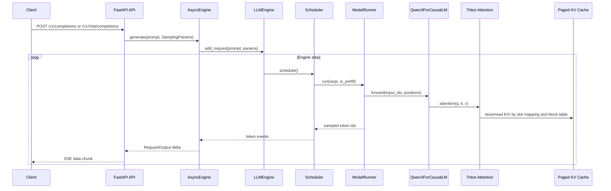

# Nano-vLLM Architecture

Nano-vLLM is a compact inference engine that exposes both an offline generation API and an OpenAI-style HTTP API. The implementation centers on a scheduler, a paged KV cache, Triton attention kernels, and a model runner for Qwen3 execution.

## Request lifecycle

### Offline generation

`nanovllm.LLM` wraps `LLMEngine`. `LLM.generate(prompts, sampling_params)` tokenizes string prompts, creates `Sequence` objects through `LLMEngine.add_request()`, and repeatedly calls `LLMEngine.step()` until the scheduler has no waiting or running work.

Each step returns finished sequence outputs for offline generation. The method records internal prefill/decode timing and finally decodes completion token IDs into `{"text", "token_ids"}` dictionaries.

### Online API requests

`nanovllm.entrypoints.openai.api_server` builds a FastAPI app around `AsyncEngine`. The server supports:

- `GET /health`
- `GET /v1/models`
- `POST /v1/completions`
- `POST /v1/chat/completions`
- `GET /v1/requests/{request_id}`
- `DELETE /v1/requests/{request_id}`

For chat requests, the server uses the tokenizer chat template and `add_generation_prompt=True`. `AsyncEngine.generate()` queues new work, starts a background asyncio task, and yields `RequestOutput` objects as tokens arrive. Streaming responses are encoded as Server-Sent Events and end with `data: [DONE]`.

## Scheduler

The scheduler owns two queues:

- `waiting`: requests that still need prefill or were preempted.
- `running`: requests that finished prefill and are ready for decode.

Scheduling first tries prefill. It scans each waiting sequence at most once per scheduling step, divides the remaining token budget across available sequence slots, and assigns `num_scheduled_tokens`. This lets long prompts make progress while shorter requests can still enter the batch.

If no prefill work is scheduled, the scheduler decodes running sequences. Each decode request appends one token. Before decode, `BlockManager.can_append()` checks whether a new physical KV block is needed. If blocks are unavailable, the scheduler preempts a running sequence, deallocates its blocks, marks it waiting, and later recomputes its prefix.

After the model runner samples tokens, `Scheduler.postprocess()` hashes newly completed blocks, advances cached-token counters, appends generated tokens, emits `(seq_id, token_id, finished)` events, and releases blocks for finished sequences.

## KV cache

The KV cache is preallocated by `ModelRunner.allocate_kv_cache()` as a tensor shaped by layer, physical block, block size, KV head, and head dimension. Each attention layer receives references to its per-layer K and V cache slices.

`BlockManager` maintains:

- physical `Block` objects with `block_id`, `ref_count`, `hash`, and `token_ids`;
- `free_block_ids` and `used_block_ids`;
- a `hash_to_block_id` map for prefix reuse;
- per-sequence `block_table` lists stored on `Sequence`.

Prefix caching only uses complete blocks. For block `i`, the hash includes the previous complete-block hash and the current block token IDs. A new sequence can reuse cached prefix blocks when the hash exists and the stored token IDs match. Reused active blocks increment `ref_count`; inactive hashed blocks can be moved from the free list back to the used set.

## Attention

`nanovllm/layers/attention.py` implements three execution paths:

- **Varlen prefill**: used when no cached prefix exists. `_varlen_prefill_kernel` consumes packed Q/K/V tensors and cumulative sequence lengths.
- **Paged prefill**: used when prefix cache makes `cu_seqlens_k[-1] > cu_seqlens_q[-1]`. `_paged_prefill_kernel` reads the full K/V context through page tables while new K/V tokens are written to cache through slot mapping.
- **Paged decode**: `_decode_paged_kernel` receives one query per sequence, walks each sequence block table up to its valid context length, and reads only valid tokens from the KV cache.

The kernels handle GQA by mapping query heads to KV heads. They use online safe softmax so the full attention score matrix does not need to be materialized.

## Execution

`ModelRunner` is responsible for model construction, weight loading, worker coordination, KV cache allocation, batch preparation, CUDA Graph replay, and sampling.

- **Model**: the current runner instantiates `Qwen3ForCausalLM` directly.
- **Batch preparation**: prefill creates packed input IDs, positions, cumulative lengths, slot mappings, and optional block tables. Decode creates one-token inputs, positions, context lengths, slot mappings, and block tables.
- **CUDA Graph**: when `enforce_eager=False`, decode batches up to 512 sequences can replay captured graphs for configured batch sizes. Prefill and oversized decode batches run eagerly.
- **Tensor Parallel**: ranks are initialized with NCCL. Rank 0 broadcasts method calls to worker ranks through shared memory and multiprocessing events.

## Serving

`AsyncEngine` bridges the synchronous engine step loop and async HTTP serving. It keeps a queue of new requests and a mapping from sequence IDs to per-request output queues. Each generated token is decoded into cumulative text plus delta text, then sent to the API layer. The API layer formats deltas as completion or chat-completion SSE chunks.

Every request has one externally visible lifecycle: `queued -> prefill -> decode -> finished`,
or the terminal state `cancelled` or `failed`. Terminal states are one-way. UUID request IDs
are the primary key for status, cancellation, timeout, and stream ownership. Explicit cancel
uses finish reason `cancelled`, deadline expiry uses `timeout`, normal generation uses `stop`,
and runner/stream failures use `error` or `backpressure`.

Serving has three bounded resource boundaries: `max_queue_size` limits queued plus active
requests and maps overflow to HTTP 429; the scheduler owns each sequence's KV block table and
releases it on completion, cancellation, timeout, or failure; and each request has a bounded
`stream_queue_size`, where a full queue terminates that request with `backpressure` instead of
blocking the global loop. `AsyncEngine.cancel()` is idempotent and also removes requests that
are still in the intake queue. `shutdown()` cancels live requests and performs bounded engine
cleanup. API handlers cancel unfinished requests from `finally` on disconnect/task cancel.
The defaults are `max_queue_size=256`, `request_timeout_s=300` seconds, and
`stream_queue_size=16`; the CLI exposes all three.

### Runtime observability

`Scheduler.get_metrics_snapshot()` is a read-only diagnostics boundary. It reports total,
current, and peak KV blocks, peak usage ratio, preemption count, and prefix-cache request,
request-hit, cached-token, request-hit-rate, and token-hit-rate counters. Prefix counters are
updated from the actual `BlockManager.can_allocate()` result: only complete cached blocks are
counted, and cached tokens are capped by the prompt token count. KV peaks are updated after
allocation, append, deallocation, preemption, and completion transitions, so an external
poller cannot miss a short-lived peak. Snapshot reads do not synchronize CUDA, allocate large
objects, or write files.

`AsyncEngine.get_metrics_snapshot()` adds active/non-terminal request count, queued/prefill/
decode and terminal counts, intake queue length, and the configured queue/timeout limits. The
active count excludes finished, cancelled, and failed requests; terminal request state remains
available through `GET /v1/requests/{id}`.

Error ownership is explicit. Tokenizer decoding, one request's output construction, enqueue,
or `add_request` failures are request-level failures: only that request is marked `failed` with
finish reason `error`, its scheduler sequence is removed, and its KV blocks are released. A
failure from `step_with_events()` or another operation that cannot be mapped to one sequence is
an engine-level failure. The runner records an `engine-level failure` diagnostic, becomes
unavailable, fails all active requests with that diagnostic, and rejects later generation
instead of retrying a damaged runner. The API maps this unavailable state to HTTP 503.

The stream protocol carries only `RequestOutput` objects. Exactly one output has
`finished=True` for every terminal path (`stop`, `cancelled`, `timeout`, `backpressure`, or
`error`); the async generator yields it and returns. There is no `None` sentinel and no
background `queue.put()` task. This keeps the configured queue capacity exact and ensures
disconnect, cancellation, timeout, backpressure, shutdown, and unconsumed terminal output do
not leave pending asyncio tasks or residual sequence mappings.

## Limits and non-goals

- The current model path is Qwen3-specific; there is no general registry for Llama, Mistral, or arbitrary Hugging Face CausalLM models.
- Quantization, LoRA, speculative decoding, prefix-cache eviction policy, CPU/GPU KV swapping, and multi-model routing are not implemented.
- The OpenAI-style API is intentionally partial and does not cover the full parameter set,
  logprobs, or SDK compatibility testing. Cancellation, timeout, bounded admission,
  backpressure, request inspection, and CPU API integration tests are implemented; production
  load testing and a full SDK compatibility matrix remain out of scope.
- Existing benchmarks do not establish vLLM performance parity. They only document Nano-vLLM behavior under specific recorded workloads.
- The project is best read as an AI-infra learning and portfolio engine, not as a mature production serving stack.
